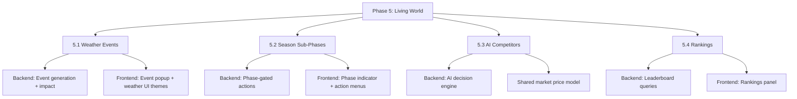

# 🎮 GDD vs. Implementation — Gap Analysis & Next Steps

> **Date**: 2026-02-16 · **Scope**: Full codebase audit against [Mark_Vinicius_V1.md](file:///c:/Users/tkogut/.gemini/antigravity/projects/mark-vinicius-cherry-tycoon/Mark_Vinicius_V1.md)

---

## Overall Progress Summary (Updated 2026-03-10)

| GDD Section | Coverage | Status |
|:---|:---:|:---|
| 1. Cherry Orchard Economics | **98%** | All formulas match §1.1-1.2; County DNA active |
| 2. Competition & Rivalry | **75%** | AI archetypes & Shared Market active; Leaderboard O(1) |
| 3. Football Clubs | **0%** | **PLANNED** (Data structures exist) |
| 4. Geographic Layer | **20%** | Opole-only; Counties verified |
| 5. Eco/Organic Farming | **100%** | Conversion & Certification fees fully implemented |
| 6. Advanced Features | **50%** | Weather active; **Pests/Insurance pending** |
| 7. Languages / i18n | **0%** | Not started |
| 8. Frontend & Mobile | **60%** | Dashboard works; competitive views pending |
| 9. ICP Integration | **100%** | Auth, Parity, Security (SEC-019/020) verified |
| 10. Game Loop (Season) | **70%** | advanceSeason works; no weekly sub-turns, no off-season phase |
| 11. Implementation Roadmap | **~Phase 1 done** | GDD Phase 0 complete; Phase 1 (AI competition) not started |
| 12. Metrics & Progression | **50%** | Farm KPIs tracked; no club KPIs, no unlock roadmap |
| 13. UI/UX Priorities | **40%** | Onboarding exists; no progress roadmap, no social proof |
| 14. Implementation Goals | **30%** | Single canister; no multi-canister architecture |

---

## What's Built (✅ "Iron Foundation")

### Backend ([main.mo](file:///home/tkogut/projects/mark-vinicius-cherry-tycoon/backend/main.mo))
- **GDD §1 Yield System**: `PP = Base × Soil × pH × Fertility × Infrastructure × TreeAge`
- **GDD §1.1 Market Saturation**: Regional supply-based pricing with time decay.
- **GDD §1.2 Cost Architecture**: Fixed/Variable/CAPEX split with maintenance logic.
- **GDD §2.0 AI Competitors**: Marek, Kasia, and Hans simulated with deterministic logic.
- **GDD §5.0 Organic Certification**: 2-season conversion cycle.
- **Phase 6.1 Scalability**: O(1) Leaderboard cache for global rankings.

### Game Logic ([game_logic.mo](file:///home/tkogut/projects/mark-vinicius-cherry-tycoon/backend/game_logic.mo))
- Precise Float-to-Int conversion for economic stability.
- Infrastructure modifiers (tractors/shakers) affecting labor productivity.

### Type System ([types.mo](file:///c:/Users/tkogut/.gemini/antigravity/projects/mark-vinicius-cherry-tycoon/backend/types.mo) — 370 lines)
- Full geographic model (16 provinces, counties, communes)
- Infrastructure types with GDD-compliant CAPEX costs
- Football club types, AI competitor types (future-ready but unused)
- Season reports, yearly reports, parcel economics breakdowns

### Frontend
- **[App.tsx](file:///c:/Users/tkogut/.gemini/antigravity/projects/mark-vinicius-cherry-tycoon/frontend/src/App.tsx)**: Main dashboard with sidebar, farm grid, sell/plant actions
- **[ParcelCard.tsx](file:///c:/Users/tkogut/.gemini/antigravity/projects/mark-vinicius-cherry-tycoon/frontend/src/components/farm/ParcelCard.tsx)** (19KB): Rich parcel display with yield tooltips
- **[ParcelDetailsPanel.tsx](file:///c:/Users/tkogut/.gemini/antigravity/projects/mark-vinicius-cherry-tycoon/frontend/src/components/farm/ParcelDetailsPanel.tsx)**: pH, soil, humidity, fertility details
- **[Marketplace.tsx](file:///c:/Users/tkogut/.gemini/antigravity/projects/mark-vinicius-cherry-tycoon/frontend/src/components/farm/Marketplace.tsx)**: Infrastructure shop (buildings + machinery)
- **[SellModal.tsx](file:///c:/Users/tkogut/.gemini/antigravity/projects/mark-vinicius-cherry-tycoon/frontend/src/components/farm/modals/SellModal.tsx)** (18KB): Retail/wholesale with dynamic pricing breakdown
- **[FinancialReportModal.tsx](file:///c:/Users/tkogut/.gemini/antigravity/projects/mark-vinicius-cherry-tycoon/frontend/src/components/farm/modals/FinancialReportModal.tsx)** (24KB): Season & yearly reports
- **[OnboardingModal.tsx](file:///c:/Users/tkogut/.gemini/antigravity/projects/mark-vinicius-cherry-tycoon/frontend/src/components/farm/modals/OnboardingModal.tsx)**: New player registration
- **PWA**: manifest.json, service worker, install prompt
- **Auth**: Internet Identity via `@dfinity/auth-client`

---

## What's Missing — Phase 7.0 & Beyond

### 🔴 Priority 1: The Living World (Phase 7.0)
- [ ] **Pest & Disease Events**: Random yield loss events mitigated by Sprayer infra.
- [ ] **Insurance System**: Purchase policies to protect against weather/pests.

### 🟠 Priority 2: Competitive Depth
- [ ] **Contract Auctions**: AI competitors outbidding player on high-value contracts.
- [ ] **Sabotage**: Low-reputation actions against AI farms.

### 🟡 Priority 3: Meta-Layer Expansion
- [ ] **Football Club Logic**: Implementation of the `club_logic.mo` module.
- [ ] **Geographic Expansion**: Unlocking Lower Silesia / Silesia provinces.

| # | Gap | GDD Reference | Effort |
|---|:----|:---|:---:|
| 1a | **Season Sub-Phases** – Currently one button advances season. GDD describes 4 sub-phases: Preparation → Growth → Harvest → Sales → Off-season. Each should present different decisions. | §10 | Medium |
| 1b | **Pre-Season Planning UI** – Choose hiring, buy supplies, set strategy before growth starts. | §1.3, §10 | Medium |
| 1c | **Off-Season Actions** – Infrastructure upgrades, planning for next year. Currently upgrades happen any time. | §10 | Low |
| 1d | **Financial Result End-Screen** – Season summary showing net profit, XP gained, reputation change, and "what to focus on next." | §1.3 | Low |

### 🟠 Priority 2: Weather & Risk Events (GDD Section 6)

The game feels static without random events. This is the biggest engagement gap.

| # | Gap | GDD Reference | Effort |
|---|:----|:---|:---:|
| 2a | **Weather Event System** – Backend: generate random events (frost, drought, heatwave, rain) each season based on probability. Frontend: event popup with impact summary. | §6 | High |
| 2b | **Pest & Disease Events** – Random insect/fungi events that destroy yield % unless player invested in sprayers/treatments. | §6 | Medium |
| 2c | **Weather-Based UI Themes** – Change dashboard colors per season (already in frontend backlog). | Frontend backlog | Low |

### 🟡 Priority 3: Competition & Rankings (GDD Section 2)

Required for replayability and the "shared market" feel.

| # | Gap | GDD Reference | Effort |
|---|:----|:---|:---:|
| 3a | **AI Competitor Farms** – Create 3-5 AI farms (types defined in `types.mo`). They make simplified decisions each season, affecting shared market prices. | §2 | High |
| 3b | **Market Price Impact from Total Supply** – Currently saturation is per-player only. Should factor in AI + all players' total supply. | §2 | Medium |
| 3c | **Rankings Display** – Farm value, profit/season, efficiency (profit/ha). Backend already tracks stats; needs leaderboard query + UI. | §2 | Medium |
| 3d | **Wholesale Contracts (Auction)** – Limited contracts that players/AI compete for with offers. | §2 | High | - .agent/knowledge/gdd_competitive_pool.md

### 🟢 Priority 4: Geographic Expansion (GDD Section 4)

| # | Gap | GDD Reference | Effort |
|---|:----|:---|:---:|
| 4a | **Interactive Poland Map** – SVG/Leaflet map showing provinces. Only Opole clickable, rest "locked – coming soon." | §4, §8 | High |
| 4b | **Province-Level Economics** – Prices, demand, labor cost actually vary by province (data structure exists, not wired up). | §4.1 | Medium |
| 4c | **Commune Details** – Urban/rural labor type affects costs and market size (partially in `Region` type). | §4.1 | Low |

### 🔵 Priority 5: Football Clubs (GDD Section 3) - .agent/knowledge/gdd_sports_patron.md

This is the "meta-layer" — should only come after the farming loop is mature.

| # | Gap | GDD Reference | Effort |
|---|:----|:---|:---:|
| 5a | **Club Investment Backend** – Buy/sell stakes, set budgets, manage transfers. | §3.2 | Very High |
| 5b | **League Simulation** – Simplified match engine, season results, promotion/relegation. | §3.1 | Very High |
| 5c | **Club Management UI** – Squad view, stadium upgrades, ticket revenue display. | §8 | High |
| 5d | **Farm-to-Club Cash Flow** – Reinvest orchard profits into club shares. | §3.2 | Medium |

### ⚪ Priority 6: Polish & Long-Term Features

| # | Gap | GDD Reference | Effort |
|---|:----|:---|:---:|
| 6a | **Localization (i18n)** – EN/PL/DE with key-value JSON, browser detection, flag switcher. | §7 | Medium |
| 6b | **Processing Facility** – Build jams/juices factory for higher margins (later-game). | §1.1 | Medium |
| 6c | **Seed Selection / Crop Diversification** – Breed varieties, grow apples/plums. | §6 | High |
| 6d | **Insurance System** – Buy crop insurance, payout on weather events. | §6 | Low |
| 6e | **NFT Integration** – Parcels & club shares as NFTs on ICP. | §9 | Very High |
| 6f | **Multi-Canister Architecture** – Split into world/farms/clubs/market/ranking canisters. | §9 | Very High |
| 6g | **DAO Governance** – Player voting to unlock provinces. | §9 | Very High |

---

## Recommended Next Phase: "Phase 5 — Living World"

Based on the gaps above, I recommend the following as the **immediate next development phase** to bring the game from "functional prototype" to "engaging MVP":

### Phase 5.1 — Weather & Events (est. 3–5 days)
1. Add `generateWeatherEvent()` to `game_logic.mo` using season-based probability tables
2. Integrate into `advanceSeason()` — apply yield impact, show event name
3. Add pest/disease events with prevention check (sprayer infrastructure)
4. Frontend: event popup modal, seasonal background color themes

### Phase 5.2 — Season Sub-Phases (est. 2–3 days)
1. Add `SeasonPhase` type: `#Preparation | #Growth | #Harvest | #Sales | #OffSeason`
2. Gate actions by phase (e.g., can only harvest in `#Harvest`, only upgrade in `#OffSeason`)
3. Frontend: phase indicator in header, contextual action buttons

### Phase 5.3 — AI Competitors (est. 5–7 days)
1. Implement `AIFarm` state and `simulateAITurn()` in a new `ai_logic.mo` module
2. 3 AI personalities: Traditionalist (low risk), Innovator (organic), Businessman (wholesale)
3. AI sells into shared market → affects saturation for all players
4. Display AI farm summaries in a "Competitors" tab

### Phase 5.4 — Rankings & End-of-Season Summary (est. 2–3 days)
1. Add `getLeaderboard()` query returning top farms by profit, value, efficiency
2. End-of-season results screen with KPIs, comparison vs. AI, next goals
3. Frontend: Rankings panel accessible from navigation

> [!IMPORTANT]
> **Football Clubs (GDD Section 3)** should remain paused until Manager decides to implement it. The farming core loop needs weather, competition, and progression depth before adding the club meta-layer.

---

## Current Backlog Items Still Open

From [frontend backlog](file:///c:/Users/tkogut/.gemini/antigravity/projects/mark-vinicius-cherry-tycoon/.agent/rules/02_frontend_backlog.md):
- [ ] Yield Comparison View (peak production indicator)
- [ ] Market Saturation Visuals (volume penalty display)
- [ ] Historical Price Graph (optional)
- [ ] Weather-Based UI Themes

From [master plan](file:///c:/Users/tkogut/.gemini/antigravity/projects/mark-vinicius-cherry-tycoon/.agent/rules/00_master_plan.md):
- [ ] Backend verification of all functions via `dfx canister call`
- [ ] Error handling for seasonal restrictions (toast testing)
- [ ] Code cleanup (remove debug logs)
- [ ] Infrastructure Shop UI (partially done via Marketplace)

> [!TIP]
> The **Marketplace.tsx** component already implements the infrastructure shop, so the "Infrastructure Shop UI" item in the master plan can likely be marked as done after a quick verification pass.
